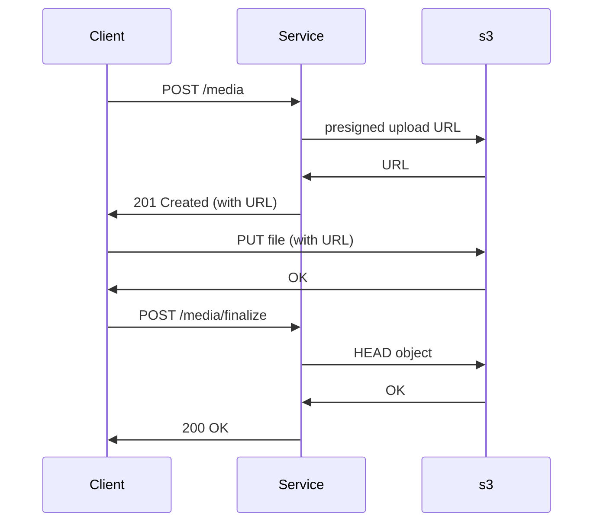
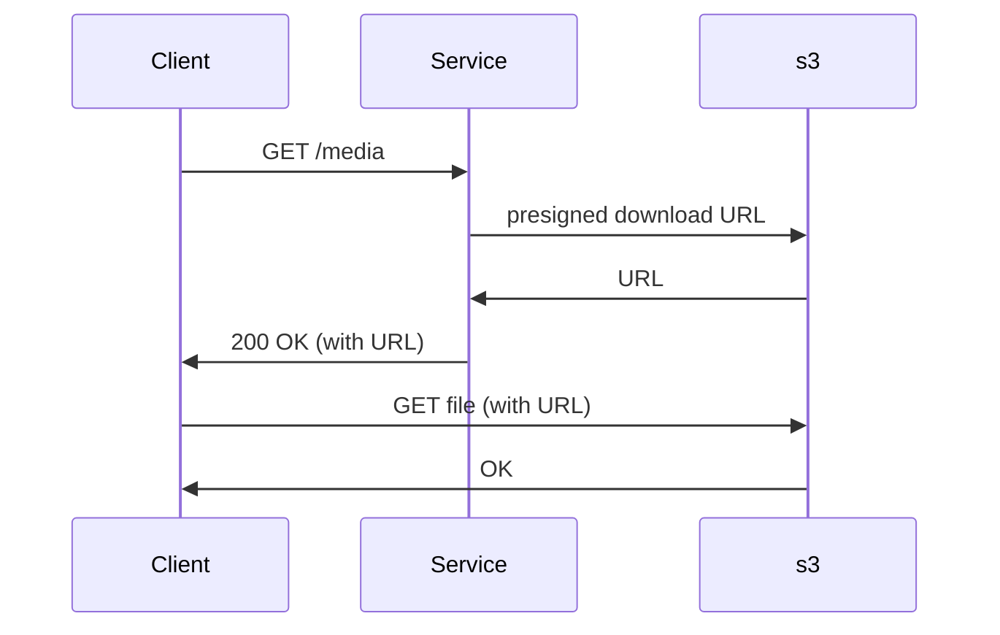

# Media managment architecture

The media managment needs to allow the correct processing of two entities:

1. Tags
2. Media (only images and videos) 

## Assumptions

- the current development is an MVP;
- the service (see below for further details) should run behind an API gateway and a load balancer, hence we are not going to implement and cyphering of the incoming/outgoing data nor any load balancing logic;
- User permissions and management is out of scope. This will have the consequence of allowing any client to access any tags/media registered in the service. This is clearly a major development axe for the future. 
- there is currently no need to notify other services of the status changes of media and tags. It is a self-contained, indipendent system;
- no housekeeping on the data; this is reserved for the future;
- no backup nor replication as well, as this can be done externally on the single resource, if needed.
- currently we do not care about the localisation of the client: everything is stored toghether;
- we will stick to a minimum viable regarding metrics, namely: how many request on which path, the result status code and an average time; 
- log will be prompted on stdout;
- no release managment. this will be done elsewhere;

## Macro system

The system needs to handle media files, specifically images and videos, and the latter can have dimensions critical to the good working of the service. As such, we are going to leverage on amazon s3 as a well-established commercial 3rd-party cloud services for the files storage. 

As data storage we choose PostgresSQL, because of the following point:
- well-established and robust SQL-like database solution;
- handful of plugins available for future development;
- can cope with high volume of data and search functionality;
- allow easy retrieval of data, provided it is correctly indexed; 

The system is described on the following schema:

```mermaid
architecture-beta

group Media(cloud)[Media]

service API(server)[Service] in Media
service s3(logos:aws-s3)[s3] in Media
service db(database)[DB] in Media

service client(internet)[Client]

client: R<-->L :API
client: B-->L :s3
API: B-->T : s3
API: R-->L : db

```

The idea is that a service like s3 is much more competent than us in processing the files hence we are going to leverage on it. 

For the tags processing, the flow is straightforward: for creation and retrieval the client call the service which uses the postgreSQL DB as data storage; 

For media processing, we have the two flows of creation and retrieval:

### creation of media
The flow is:
1. A client send a request to create a media file. It is demanded to provide some info (like size and the sha256 checksum) on the file to upload;
2. the service request the file storage system a presigned upload URL. It then creates the resource on the data storage; The service returns the client the created resource with the upload request;
3. the client uses the presigned request to upload the file;
4. the client send a finalize request to the service;
5. the service checks that the upload is successfull and update the internal state of the file;
6. the service returns the updated resource.

(we hide here the DB, which is used by the service to retrieve/store information on the file)

### retrieval of media
The flow is similar to the creation: 
1. A client send a request to retrieve a media file. 
2. the service request the file storage system a presigned download URL (with a limited expiration date). The service returns the client the created resource with the download request;
3. the client uses the presigned request to download the file;

## Service

The service itself is an API service exposing endpoints to handle tags and media files. 
It is architectured as a lightweight clean archictecture service on 3 layers: 
- the domain defines core data transitioning between the other 2 layers;
- the usecases defines business logics to apply to the data; There is a specific usecase for each route defined by the service;
- adapters defines how the domain data should interact with external systems. We currently have incoming/outgoing http requests, db storage and file storage and metrics (using vanilla expvar).

In order to keep it simpler, only the http adapter defines specific data structures to control what the client sends/receives. db storage and file storage uses the domain models directly. This is possible because the core data and what it is used by the adapters do not diverge significantly.

### Configuration
TODO

### Errors

## Local

TODO

## To the moon

TODO